# template-shiny-golem

`template-shiny-golem` contains the necessary files to set up a `golem` project using `renv` in a Dev Container. During the first execution, it runs `golem::create_golem()` to generate all required project files and initializes `renv` in `explicit` mode. It also commits and pushes these files to version control. A reference file named `INIT_FLAG` is created to prevent these steps from being repeated in future container builds. For subsequent builds, the project is restored using `renv::restore()`, which takes advantage of [renv's cache feature](https://github.com/rocker-org/devcontainer-features/tree/main/src/renv-cache). In all cases, builds finish with the installation of development packages (e.g. `devtools`) because these packages are not usually included in `renv.lock` file.

## Requirements

  - [Docker](https://docs.docker.com/engine/install/). While not mandatory, we recommend installing it via [Docker Desktop](https://docs.docker.com/desktop/install/windows-install/).
  - [VS Code](https://code.visualstudio.com/)
  - VS Code's [Dev Container Extension](https://marketplace.visualstudio.com/items?itemName=ms-vscode-remote.remote-containers)
  - [git](https://git-scm.com/). While not mandatory, we recommend using [GitHub Desktop](https://desktop.github.com/download/).

## Quickstart

Click `Use this template` and `Create a new repository`:

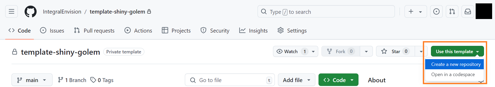

Fill the different fields and click `Create repository`:

**IMPORTANT**: The repo name must follow R package name's requirements: (1) it may only contain numbers, letters, and periods; (2) it must start with a letter; and (3) it can't end in a period. This means repo names cannot have hyphens or underscores, unfortunately.

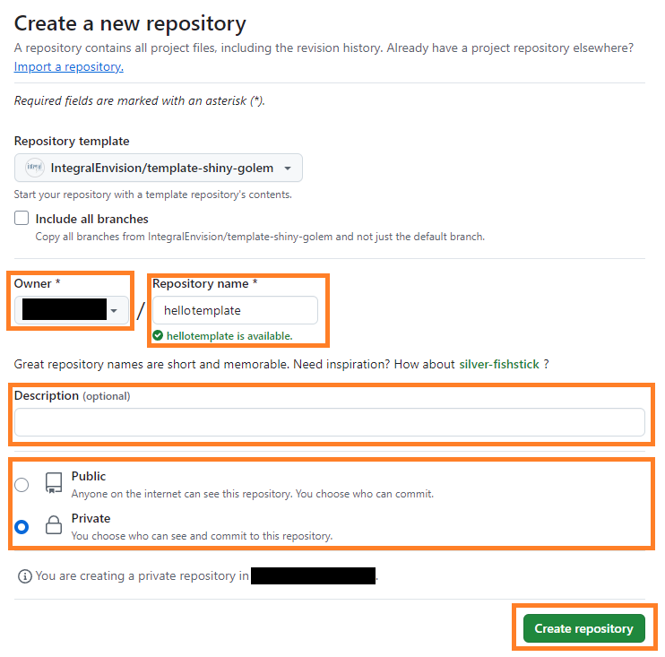

Clone the repository using the method you're most comfortable with. Here's how to do it using GitHub Desktop:

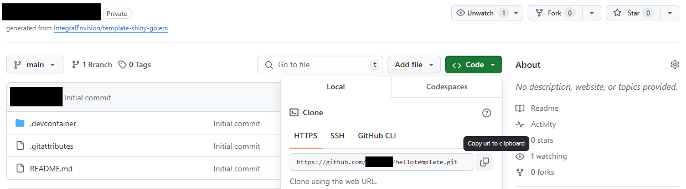

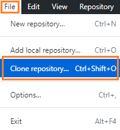

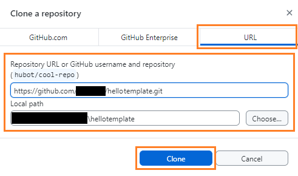

Open the folder in VS Code. You can do so from GitHub Desktop:

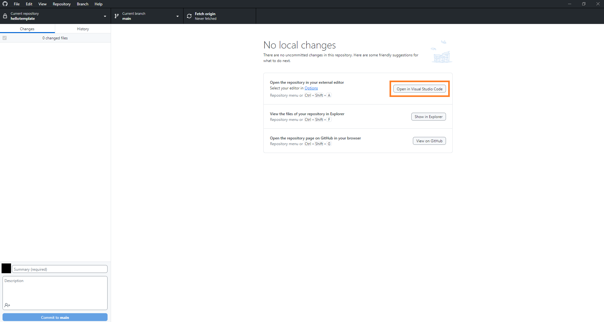

Select `Yes, I trust the authors`:

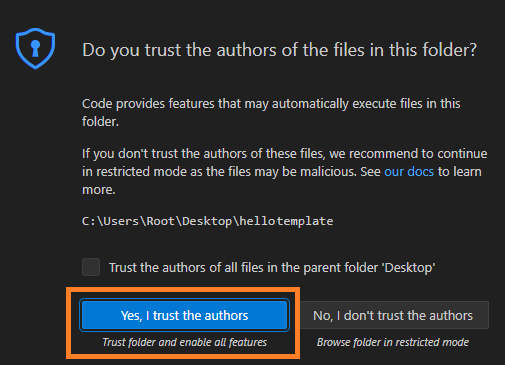

Click `Reopen in Container` (bottom right corner):

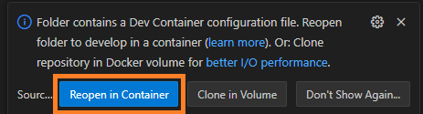

*NOTE*: Alternatively, you can select **Dev Containers: Reopen in Container** from the Command Palette (`F1`) to perform this action.

The Dev Container initialization may take a few minutes.

The message `Done. Press any key to close the terminal.` in `TERMINAL` tab indicates that the process completed successfully:

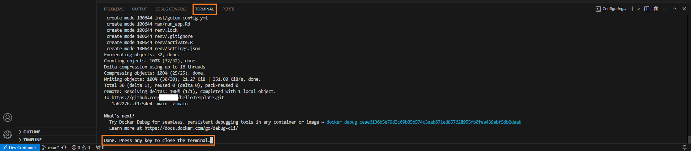

*NOTE*: If you encounter any errors, you can review the logs to troubleshoot or contact a team member for assistance.

You should see a new commit in GitHub:

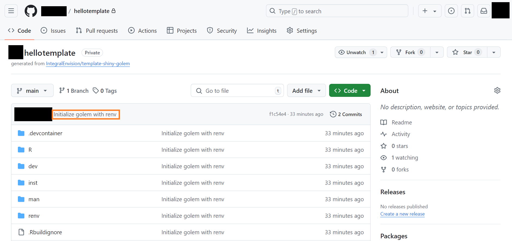

To launch an R Terminal, select **R: Create R terminal** from the Command Palette (`F1`). Alternatively, you can click the `⌄` icon in VS Code Panel and select **R Terminal**:

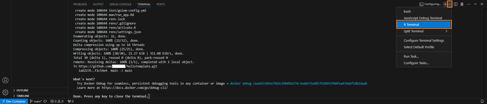

Remember to select the R Terminal in the right sidebar to open it:

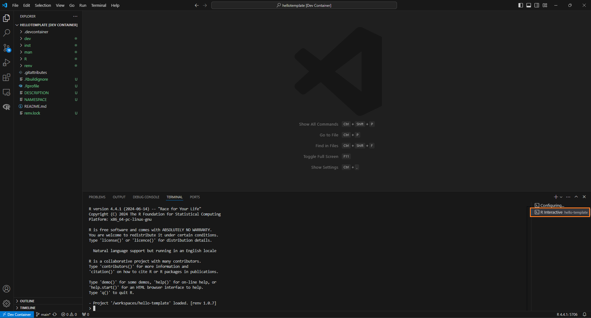

*NOTE*: If you are using Windows, you may notice that the **Explorer** tab shows version control changes (highlighted in green) that lag what has actually already been committed to git. Check [Source Control in devcontainers does not auto-refresh; requires manually pressing refresh button](https://github.com/microsoft/vscode-remote-release/issues/9399) for more information about this problem. We recommend GitHub Desktop for version control over VS Code's **Source Control** tab because it does not need any manual refresh.

## Exit Dev Container

To exit the Dev Container, click **Dev Container** (bottom left corner) and select one of the following commands:

- **Reopen Folder Locally**: This option will close the current Dev Container session and reopen the project folder in your local environment, outside of the containerized setup. It's useful when you want to switch back to your local development environment while keeping the same project open.
- **Close Remote Connection**: This will close the connection to the Dev Container and stop the container. The current workspace will be closed, and you'll be returned to the main VS Code window without any active workspace or connection.

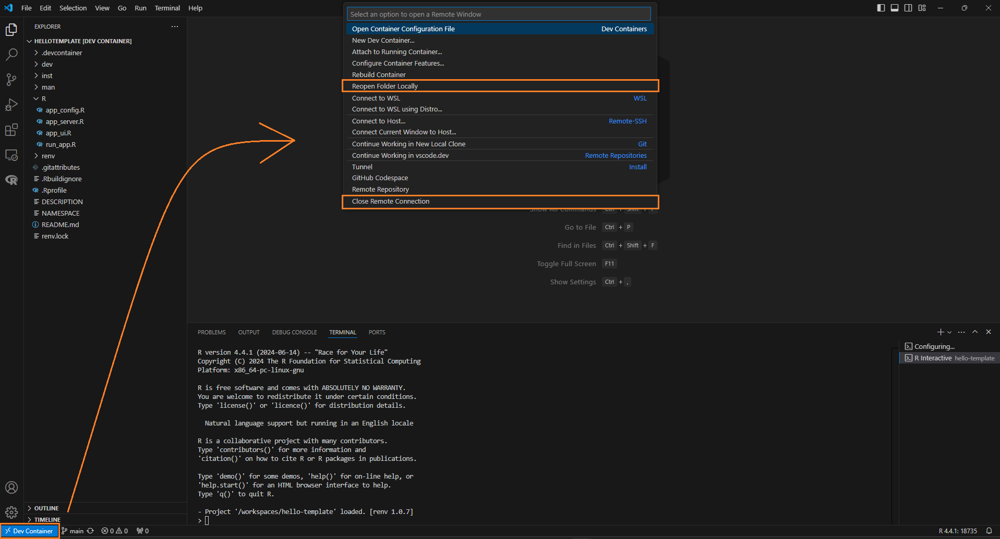

## Remove Dev Container

Containers and images can take up considerable storage. If you're done with a project or the container is no longer needed, removing it can free up disk space.

*NOTE*: If you work on the project on a regular basis, it’s not *necessary* to remove the Dev Container after you exit it.

To remove the Dev Container:

1. [Exit the Dev Container](#exit-dev-container)
1. Remove the container
1. Remove associated images

The following steps demonstrate how to remove the container and associated image using Docker Desktop. You can also use Docker’s command-line interface to perform the same tasks.

### Remove Container

1. Go to Containers tab
2. Locate the container associated with your Dev Container and click the corresponding trash icon to stop and delete it

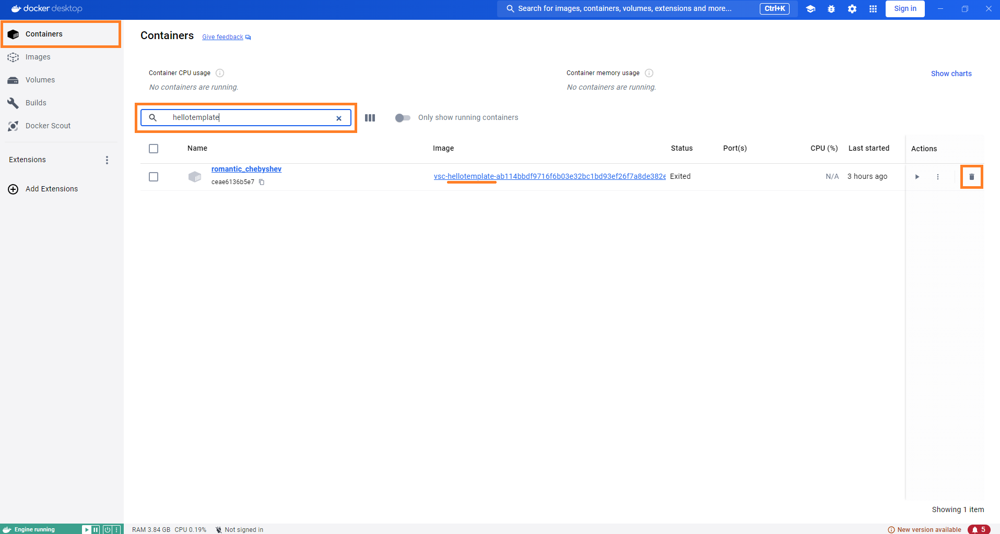

### Remove Images

1. Go to Images tab
2. Locate the images associated with your Dev Container and click the corresponding trash icons to remove them from your local Docker repository

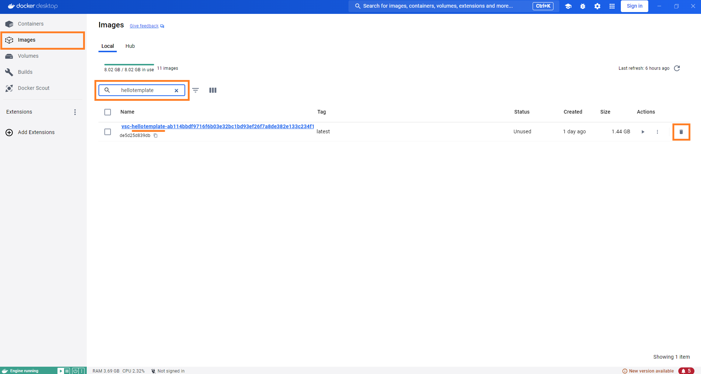

## Details

[.devcontainer](/.devcontainer) directory contains the necessary files to set up a [development container](https://code.visualstudio.com/docs/devcontainers/containers):

- [devcontainer.json](/.devcontainer/devcontainer.json) describes how VS Code should start the container and what to do after it connects. In this file:
    - **Edit packages in** `"remoteEnv"` **as needed**
    - **Edit** `"customizations"` **as needed**

- [Dockerfile.Dev](/.devcontainer/Dockerfile.Dev) contains a set of instructions on how to build the Docker image to run the application in development. In this file:
    - **Update** `rocker/r-ver` **and** `RENV_VERSION` **as new versions become available**. These values are hard-coded rather than automatically determined using the latest versions to ensure consistency across project builds, as relying on the latest versions could result in differing environments at different points in time.
    - **Add system requirements as needed**.

## Development Workflow

- Use this template to create a new repo. **IMPORTANT**: The repo name must follow R package name's requirements: (1) it may only contain numbers, letters, and periods; (2) it must start with a letter; and (3) it can't end in a period. This means repo names cannot have hyphens or underscores, unfortunately.
- Clone the repo in your local machine.
- Open the folder in VS Code and Reopen in Container. You should see a new commit in GitHub.
- Develop the app:
    - Use `package::function` notation.
    - To install a package run `renv::install("PACKAGE_NAME")`. If the installation fails due to missing system requirements, update [Dockerfile.Dev](/.devcontainer/Dockerfile.Dev) and Rebuild the Container.
    - Before pushing commits to the repo, ensure that the changes include an updated `renv.lock` that matches packages used in the app. To do so:
        1. Run `attachment::att_amend_desc()`, which automatically updates packages listed in `DESCRIPTION` based on the app code
        1. Run `renv::snapshot()`, which updates `renv.lock` based on `DESCRIPTION`
    - Use `golem::run_dev()` to launch the app.

## Deployment Workflow

Create a `Dockerfile` file at the root of the repo using [Documentation/examples/Dockerfile.renv](https://github.com/IntegralEnvision/shinyproxy-configs/blob/main/Documentation/examples/Dockerfile.renv) as a baseline. R version, system requirements and {renv} version should match the ones used in [Dockerfile.Dev](/.devcontainer/Dockerfile.Dev).

Test building the Docker image and running the Shiny app in a Docker container **locally** (i.e. *outside* the Dev Container) following the instructions described in [Deploying (or re-deploying) a Shiny app to ShinyProxy](https://github.com/IntegralEnvision/shinyproxy-configs/blob/main/Documentation/SOPs/Setting-Up-ShinyApp-CICD.md). 

For more information about deployment refer to [shinyproxy-config](https://github.com/IntegralEnvision/shinyproxy-configs) repo.
